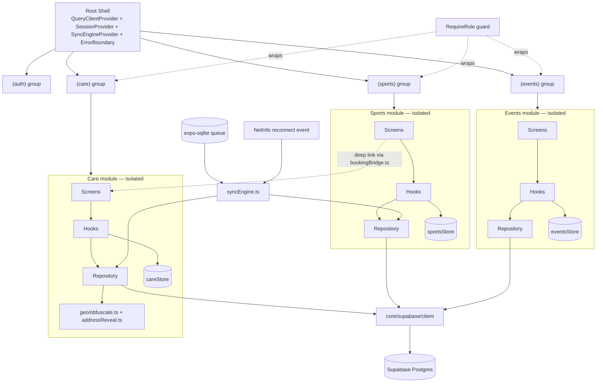
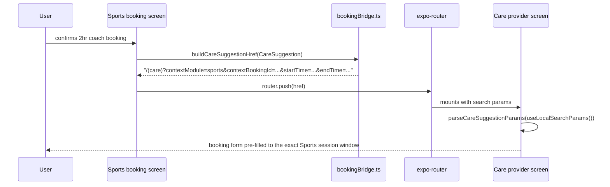
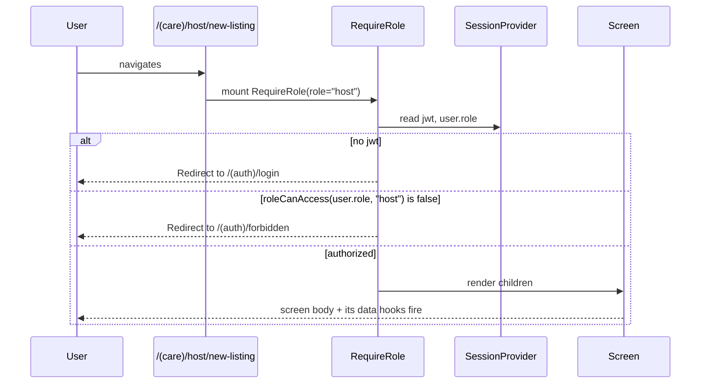
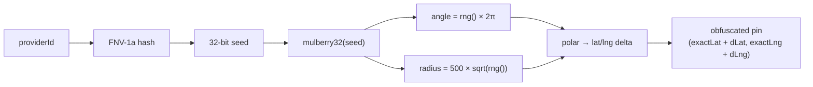
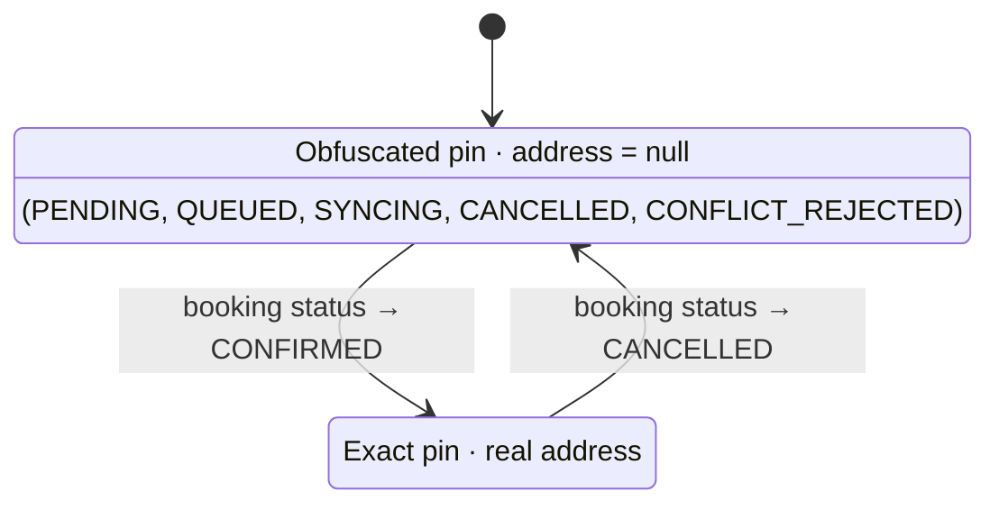
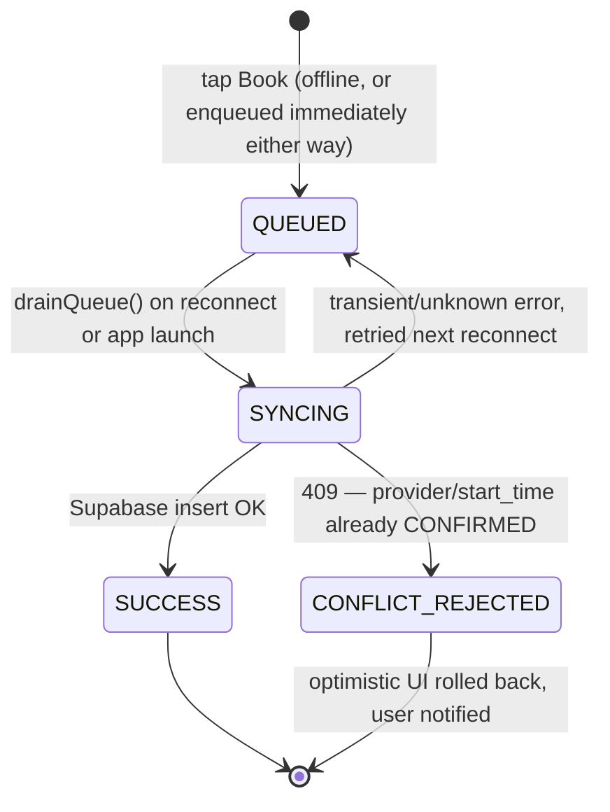

# WeSocial — Super-App Prototype

React Native (Expo Router) + TypeScript + Supabase prototype for the WEVSOCIAL technical
assessment, focused on **Module Isolation**, **Geo-Privacy**, and **Offline-First Coordination**
across three mini-apps: Sports, Events, Care.

Built AI-assisted end to end (as the assessment explicitly encourages) with architectural
decisions, review, and edge-case reasoning driven manually at each step — the sections below are
that reasoning, not generated boilerplate.

## Running locally

```bash
npm install
cp .env.example .env   # fill in a real Supabase URL/anon key if you want live data
npm start              # then press i / a / w, or scan the QR code with Expo Go
```

`npm run typecheck` and `npm run lint` should both be clean. There is no `.env` committed —
`.env.example` documents the two variables required (`EXPO_PUBLIC_SUPABASE_URL`,
`EXPO_PUBLIC_SUPABASE_ANON_KEY`). All booking/provider data is served from in-memory mock
repositories (see **Limitations**), so the app runs fully offline-first even without a live
Supabase project — the env vars only need to be *present*, not point at a real project, unless
you want to swap the mocks for real queries.

Database schema: [`supabase/schema.sql`](supabase/schema.sql).

## System Architecture

### High-Level Design



No arrow crosses a module subgraph boundary except through `bookingBridge.ts` (a typed DTO, not a store/repo import) and `syncEngine.ts` (which reaches repositories through their public interface to drain a mixed-module queue — never through internals). That's the isolation guarantee in one picture: three closed boxes, two explicitly-typed seams.

**Module isolation is structural, not just conventional.** Each mini-app is a folder tree that's
never imported by the other two:

```
app/(sports)/...      modules/sports/{types,repository,hooks,store}
app/(events)/...      modules/events/{types,repository,hooks,store}
app/(care)/...        modules/care/{types,repository,hooks,store,geo}
```

- **Navigation**: each module folder is its own `expo-router` group with its own `_layout.tsx`
  Stack. They're siblings under the root Stack, not nested tabs — I chose this over an
  `app/(tabs)/(sports)` nested-stack-inside-tabs layout because that pattern is easy to misconfigure
  blind (tab bar swallowing back-gestures, double-mounted stacks) for marginal UX gain in a
  prototype where navigation polish is 10% of the grade. A shared `ModuleSwitcher` component gives
  tab-like switching without coupling the three stacks together.
- **State**: each module owns a `zustand` store scoped to its own concerns (`sportsStore`,
  `eventsStore`, `careStore`). Nothing is shared globally; resetting or hot-reloading one module's
  store cannot touch another's.
- **Data layer**: one `QueryClient` at the root, but isolation comes from query-key namespacing
  (`['sports', ...]`, `['care', ...]`) plus the fact that no module's hooks/repositories import
  another module's files — a shared cache instance costs nothing in isolation but avoids
  duplicating cache plumbing three times.
- **Repository pattern, enforced, not just followed**: UI components and hooks never call
  Supabase directly. An ESLint rule (`no-restricted-imports` on `@core/supabase/client`, scoped
  everywhere except `modules/*/repository/**`) makes this a lint error, not a style guideline —
  verified against a probe file during development (see Part 4 commit).

**Cross-module coordination without cross-module coupling**: Sports and Care are only allowed to
talk through `core/crossModule/bookingBridge.ts`, a typed DTO + deep-link builder. When a Sports
booking confirms, it builds a `CareSuggestion` (context module, context booking id, exact time
window) and pushes `/(care)?contextModule=sports&...`. The Care module reads that from its own
`useLocalSearchParams()` — it never reaches into Sports' store or repository to get there. This is
the same shape as `core/offline/syncEngine.ts`, which also legitimately reaches across modules
(it has to, to drain a mixed-module queue) — but it does so through each module's public
repository interface, never through internals.

#### Low-Level Design — cross-module handoff



`CareSuggestion` (`core/crossModule/bookingBridge.ts`) is the entire contract — Care never imports Sports' store, repository, or types to get here, only this DTO parsed back out of its own route params.

**RBAC**: `core/rbac/RequireRole` wraps a screen/layout with a minimum role (`guest < member <
host`). A Guest hitting `/(care)/host/new-listing` is `<Redirect>`ed to a forbidden screen before
that screen's body — or any data hooks it would have called — ever mounts. This is enforced twice
on that route: once at the module layout level (`guest` minimum, i.e. "must be signed in") and
again at the screen level (`host` minimum) — composition of the same primitive, not a special case.

#### Low-Level Design — route guard



The redirect happens before `children` ever mounts — an unauthorized user's browser/JS never executes the screen's body or fires its data hooks, so there's no button to hide and no hook to accidentally leak data through.

## Security Implementation — Deterministic Geo-Obfuscation

`modules/care/geo/obfuscate.ts`. Requirements: snap a provider's exact location to a random point
within 500m, and that point must be **stable** — same output on every render and every app
restart, without needing to persist it anywhere.

**Approach**: hash `providerId` with FNV-1a into a 32-bit seed, feed that seed into `mulberry32` (a
small, fast, deterministic PRNG), then sample a point **uniform over the area** of a 500m disc and
convert the polar offset to a lat/lng delta.

#### Low-Level Design — obfuscation algorithm



Same `providerId` in → same seed → same PRNG sequence → same pin, every render and every restart, with no write to storage. `sqrt(rng())` (not `rng()`) is the one step that makes this a *uniform-area* sample rather than a center-biased one — see below.

**Why this specific math, and the one detail that's easy to get wrong**: sampling the radius as
`R * rng()` biases points toward the center — the area of an annulus at radius `r` grows with `r²`,
so a linear draw over-represents small radii. Sampling `R * sqrt(rng())` instead makes the point
uniform over the disc's *area*, which is the geometrically correct reading of "a random point
within 500m," not just "a random distance within 500m." I verified this empirically rather than
just asserting it — a standalone script (logic mirrored, not imported, to avoid RN dependencies)
ran the function over 5,000 synthetic provider ids and confirmed: max distance 499.4m (bound
respected), mean distance 333.6m, matching the closed-form expected mean for uniform-disc sampling
of `500 × 2/3 ≈ 333.3m`.

**Why hash+PRNG instead of, say, a hexbin/grid snap**: a grid snap is simpler but leaks structure
(nearby providers snap to visibly aligned points, and the grid cell size trivially caps the
obfuscation radius in a way a determined viewer can reverse-engineer). Seeding a PRNG per-provider
gives each provider an independent, non-visually-correlated offset, and the "stability" requirement
falls out for free — it's a pure function of an id that doesn't change, no cache or storage layer
needed to keep it fixed across restarts.

**Address reveal state machine** (`modules/care/geo/addressReveal.ts`): a pure function,
deliberately kept out of React/React Query so it's reasoned about independently of rendering —
`PENDING | CANCELLED | QUEUED | SYNCING | CONFLICT_REJECTED → obfuscated pin, address null` /
`CONFIRMED → exact pin, real address`. The map screen renders whichever pin this function returns;
it never has its own notion of "revealed."



Every non-`CONFIRMED` status collapses to the same `Hidden` branch by design — a queued-but-not-yet-synced booking gets exactly the same privacy treatment as a rejected one, so there's no intermediate state that accidentally leaks the real address.

**Where the real boundary has to live**: client-side gating is a UX safeguard, not security — a
client that wanted to could just read `providers.exact_lat` directly from PostgREST regardless of
what the UI shows. `supabase/schema.sql` documents (but does not enable, since auth is mocked per
the assessment's own FAQ) the RLS/RPC shape that would actually close this: a SECURITY DEFINER
function that checks for a CONFIRMED booking under `auth.uid()` before returning real coordinates.

## Offline Sync Logic

**State machine**: `QUEUED → SYNCING → SUCCESS | CONFLICT_REJECTED` (falls back to `QUEUED` on an
unrecognized/transient error so the next reconnect retries it, rather than silently dropping the
booking).



- **Persistence**: `core/offline/db.ts` + `queue.ts` use `expo-sqlite`, not an in-memory array —
  a booking made offline must survive the app being killed while still offline, which an in-memory
  queue cannot do.
- **Single entry point**: `core/offline/useOfflineBooking.ts` is the *only* hook Sports and Care
  booking screens call. Neither screen branches on connectivity itself; the hook decides
  online-vs-offline and either calls the repository directly or enqueues. This was a deliberate
  choice to prevent the two modules' offline behavior from drifting apart over time — one place to
  get it right, not two places to keep in sync.
- **Sync trigger**: `core/offline/networkStatus.ts` wraps `NetInfo` in a zustand store (plus a
  manual "force offline" override for demoing without airplane mode). `SyncEngineProvider`, mounted
  at the root, subscribes to that store and calls `drainQueue()` on the offline→online transition,
  and once on app launch (to catch anything left `QUEUED` from a session that was killed offline).
- **Conflict simulation**: rather than trying to race a real backend (there isn't one connected in
  this environment), `core/offline/syncEngine.ts` accepts a `simulateConflict` flag per queue item.
  When set, the sync attempt throws a `ConflictError` — a stand-in for the 409 a real
  `provider_id + start_time` unique-index violation would produce (see `schema.sql`) — before ever
  calling the repository. The rest of the path (rollback, user-visible rejection, state transition)
  runs exactly as it would against a real 409; only the trigger is manual, via a shared
  `OfflineDemoPanel` toggle used by both Sports and Care screens.
- **Rollback**: on `CONFLICT_REJECTED`, the optimistic "Booking Pending Sync" UI is replaced with an
  explicit rejection message and the error is surfaced from the queue row itself (`errorMessage`) —
  nothing pretends the booking succeeded.

## Time Log & Limitations

Built in five incremental, separately-committed phases matching the assessment's four parts (Part
1 kernel/RBAC, Part 2 geo-privacy, Part 3 offline sync, Part 4 hygiene), plus a fifth pass for
schema/docs — see commit history for the real progression rather than one large commit.

**What's intentionally thin / not finished, and why:**

- **Events module** is deliberately minimal (list + save toggle, no booking flow) — it exists to
  prove the isolation pattern replicates cleanly across a third module, not to duplicate the depth
  already built for Sports/Care. Spending equal time on all three would have traded Part 2/3 depth
  (50% of the grade) for Part 1 breadth (30%), the wrong trade given the rubric.
- **No automated test suite.** The geo-obfuscation algorithm was verified with a standalone
  Node script (determinism, 500m bound, uniform-area mean) rather than a committed Jest suite,
  to keep scope inside the time budget. Given more time, `resolveAddressReveal` and the sync
  engine's state transitions are the two pure-function surfaces I'd unit test first — both are
  already written as pure functions specifically so they're testable without mocking React Query
  or SQLite.
- **Tested on a physical Android device** (Galaxy A01, Android 16, via Expo Go) during review, which
  is what surfaced a real bug: `react-native-maps` rendered its base layer but no tiles (a gray
  grid) specifically inside Expo Go, even though that same device's standalone Google Maps app,
  network connectivity, and Google Play Services were all confirmed working independently.
  Root-caused via `adb logcat` (no native error surfaces at default log levels — the SDK fails
  silently) and cross-referenced against upstream reports —
  [react-native-maps#5888](https://github.com/react-native-maps/react-native-maps/issues/5888) and
  [expo/expo#39301](https://github.com/expo/expo/issues/39301) — which confirm Expo Go's
  bundled/shared Google Maps key is currently failing its own certificate check
  (`Authorization failure`, `INVALID_ARGUMENT`) on SDK 57, independent of anything in this app's
  code or config. `tsc --noEmit`, `eslint`, and `expo export --platform ios`/`expo-doctor` stayed
  clean throughout, as before — this was a runtime-only failure static checks can't catch, which is
  exactly why the on-device pass mattered.
- **Swapped `react-native-maps` for `react-native-webview` + Leaflet/OpenStreetMap** on the Care
  provider screen (the only screen using a map) — a deliberate deviation from the brief's listed
  stack, made for the reason above. The alternative to swapping was getting a Google Maps API key,
  which requires a Google Cloud billing account (a card on file, even within the free tier) purely
  to work around a bug in Expo Go itself, not in this app. Leaflet + OSM tiles need no key, no
  account, and no native config; `react-native-webview` is already bundled into Expo Go for SDK 57,
  so it renders correctly with zero setup, inside the exact Expo Go workflow this prototype targets.
  Trade-off: OSM's tile styling instead of Google's, no satellite/traffic layers — acceptable here
  since the map's job is showing a pin and the 500m privacy circle, not aesthetics (10% of the
  grade). Past prototype stage, the natural fix is a development build with a real, restricted
  Google Maps key (`react-native-maps` config plugin + `androidGoogleMapsApiKey`/
  `iosGoogleMapsApiKey`), which sidesteps Expo Go's broken shared key entirely.
- **RLS not enabled.** `schema.sql` documents the intended RLS/RPC shape for the address-reveal
  boundary but doesn't enable it, because the assessment's own FAQ says to mock auth — there's no
  real `auth.uid()` for a policy to key off of yet.
- **No APK/TestFlight build.** No EAS/build credentials available in this environment; "runnable
  build" here means `npm install && npm start` via Expo Go, per the assessment's own alternative
  ("...or instructions to run locally via Expo").
- **Conflict/offline demo is manually triggered**, not a race against a live Supabase project — see
  above. The state machine and rollback logic exercised are real; only the *trigger* is a toggle
  instead of physically cutting network + a second concurrent client.
